# Sports League Management System

[](https://opensource.org/licenses/MIT)

## Overview
The Sports League Management System is a comprehensive tool designed to manage data associated with sports leagues, including teams, players, coaches, referees, matches, scores, and standings. This project leverages real-time data integration, ensuring accuracy and efficiency in managing sports league data.

## Table of Contents
1. [Project Description](#project-description)
2. [Features](#features)
3. [Technologies Used](#technologies-used)
4. [Installation](#installation)
5. [Usage](#usage)
6. [Database Schema](#database-schema)
7. [ER Diagram](#er-diagram)
8. [Screenshots](#screenshots)
9. [License](#license)

## Project Description
The Sports League Management System aims to manage comprehensive data associated with sports leagues. The project utilizes real-time data from [football-data.org](https://www.football-data.org/), maintaining an updated database with minimal manual data entry, enhancing the system's efficiency and reliability.

## Features
- Real-time data integration
- Management of teams, players, coaches, referees, matches, scores, and standings
- User-friendly interface for administrators and users
- Detailed search and filtering options
- Secure authentication and authorization
- Modular design for easy maintenance and scalability

## Technologies Used
- **Frontend:** HTML, CSS (Bootstrap), JavaScript
- **Backend:** Flask (Python framework)
- **Database:** PostgreSQL
- **Other Libraries:** Requests, Gunicorn, Psycopg2, Python-Dotenv, Werkzeug

## Installation

### Prerequisites
- Docker and Docker Compose installed on your system
- Git for cloning the repository

### Setup Steps
1. Clone the repository:
   ```sh
   git clone https://github.com/yourusername/sports-league-management.git
   cd sports-league-management
   ```

2. Set up the environment variables:
   ```sh
   # The setup script will automatically create .env from .env.example if it doesn't exist
   cp .env.example .env
   ```
   Edit the `.env` file and set your environment variables:
   - `POSTGRES_USER`: Database username
   - `POSTGRES_PASSWORD`: Database password
   - `POSTGRES_DB`: Database name
   - `FOOTBALL_DATA_API_KEY`: Your API token from football-data.org
   - Other configuration variables as needed

3. Run the setup script:

   **Windows (PowerShell):**
   ```powershell
   .\setup.ps1
   ```

   **Linux / macOS:**
   ```sh
   chmod +x setup.sh
   ./setup.sh
   ```

   This will:
   - Check if Docker is running
   - Create necessary environment files
   - Build and start the Docker containers
   - Wait for PostgreSQL and apply `schema.sql` if tables are missing
   - Run SQL migrations and synchronize sequences

   If the database was partially initialized or tables are missing, reset and run setup again:

   ```powershell
   .\setup.ps1 -Fresh
   ```

   ```sh
   ./setup.sh --fresh
   ```

The application will be available at `http://localhost:5000`

### Manual Setup (Without Docker)
If you prefer to run the application without Docker:

1. Create and activate a virtual environment:
   ```sh
   python3 -m venv env
   source env/bin/activate
   ```

2. Install dependencies using Poetry:
   ```sh
   pip install poetry
   poetry install
   ```
   
   Or using pip:
   ```sh
   pip install -r requirements.txt
   ```

3. Set up PostgreSQL database and run the schema:
   ```sh
   psql -U your_username -d your_database -a -f schema.sql
   ```

4. Run the application:
   ```sh
   flask run
   ```

## Usage
### Admin Panel
- **Manage Users:** View and modify user privileges.
- **Manage Teams:** Add, update, or delete teams.
- **Manage Players:** Add, update, or delete players.
- **Manage Matches:** Schedule, update, or delete matches.

### User Dashboard
- **View Teams:** Browse team profiles and their historical performance.
- **View Players:** View player profiles and performance statistics.
- **View Leagues:** Browse different leagues and their standings.
- **View Matches:** View upcoming and past matches with filtering options.
- **Top Scorers:** See the top scorers in various leagues.

### Search Functionality
- **Search:** Find specific players, teams, stadiums, and coaches by name.

## 🎯 Kaggle Dataset
The data from this system is now available as a public dataset on Kaggle:
[European Football Leagues Database 2023-2024](https://www.kaggle.com/datasets/kamrangayibov/football-data-european-top-5-leagues)

Features of the dataset:
- Complete statistics for top 5 European leagues
- Weekly automated updates
- Available in both CSV and SQLite formats
- Comprehensive documentation and usage examples
- Clean, validated data with proper relationships

## Database Schema
The database schema is designed to minimize redundancy and ensure data integrity by using foreign keys and transactions. The main entities include users, stadiums, leagues, seasons, teams, coaches, players, matches, scores, scorers, standings, referees, and match referees.

## ER Diagram
The ER diagram illustrates the relationships between different entities in the Sports League Management System. Each table represents an entity, and the lines between them represent relationships. Primary keys are indicated by the underlined attributes, and foreign keys are shown as arrows pointing to the related primary keys.

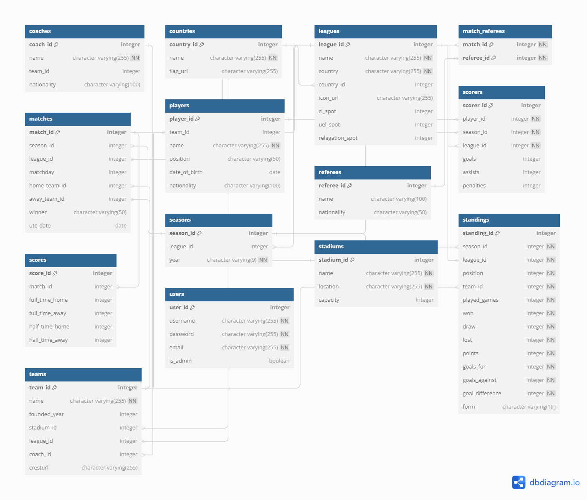

## Screenshots
### Main Starting Screen
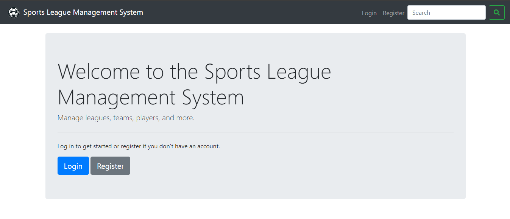

### Login Screen
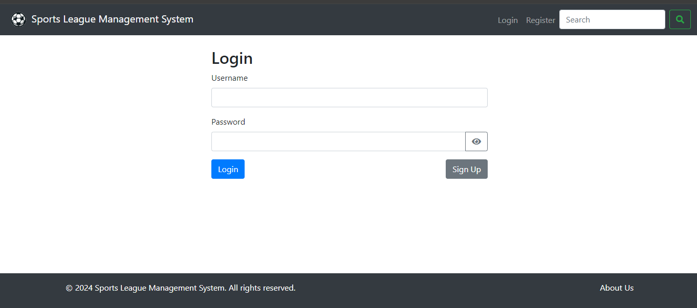

### User Dashboard
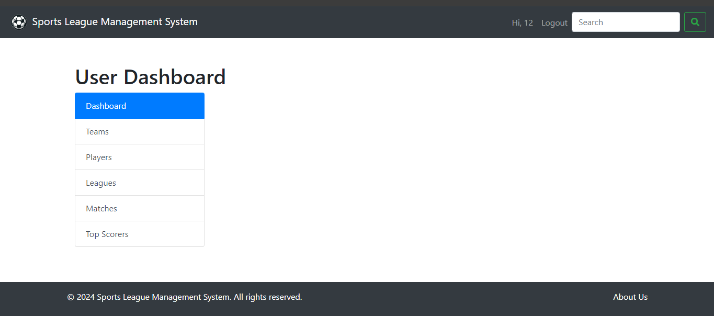

### Top Scorers Screen
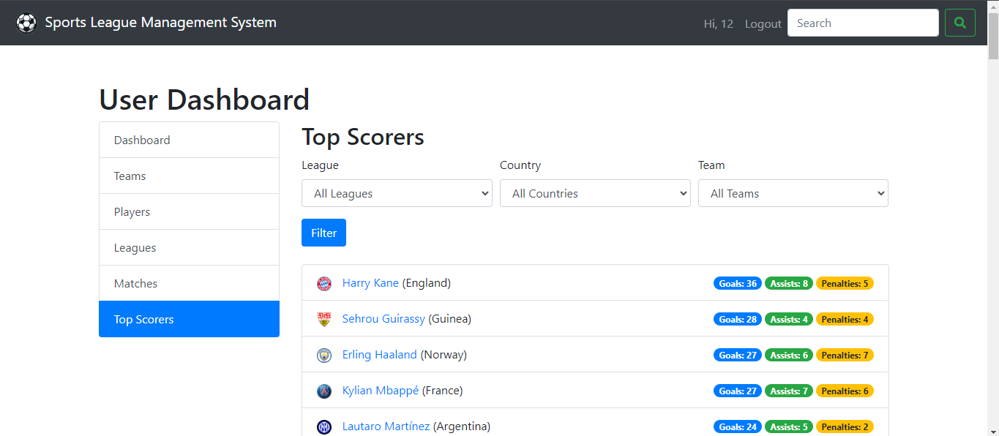

### Matches Screen
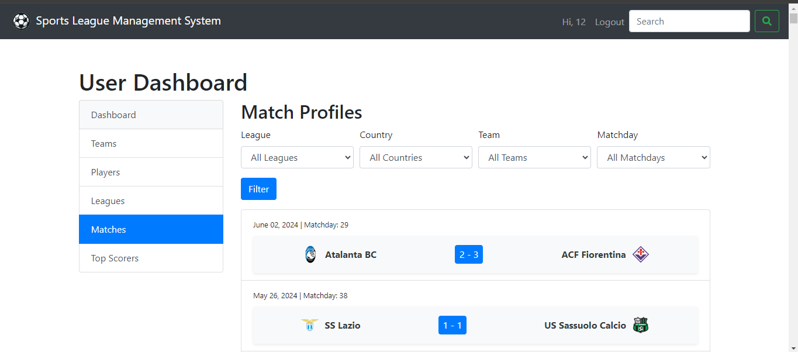

### Teams Screen
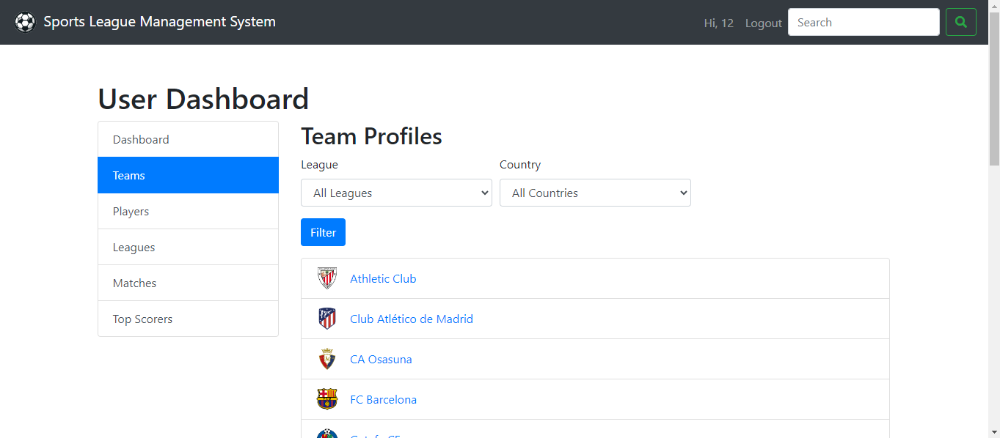

### Player Profiles Screen
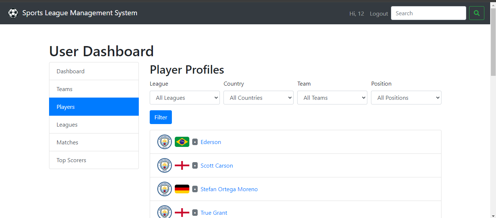

### League Profiles Screen
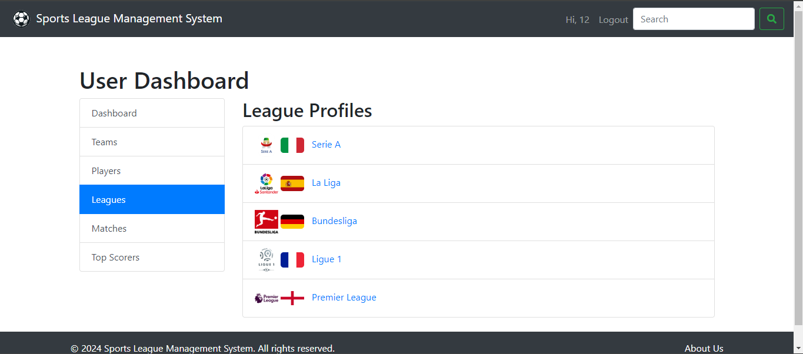

### Manage Teams Screen
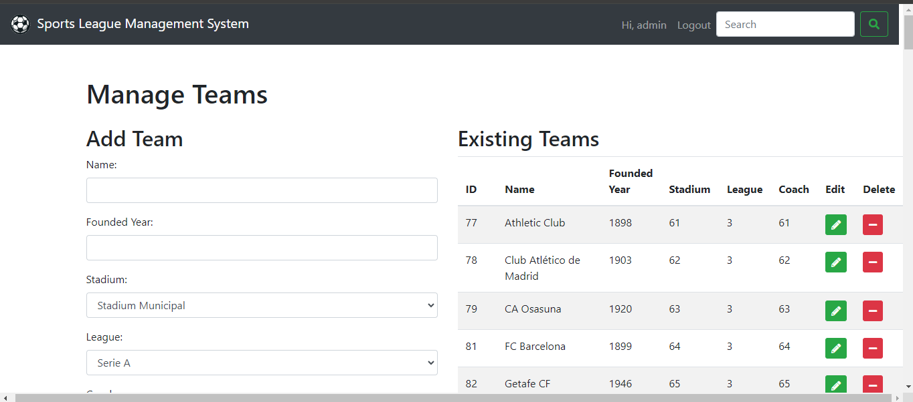

### Match Profile Screen
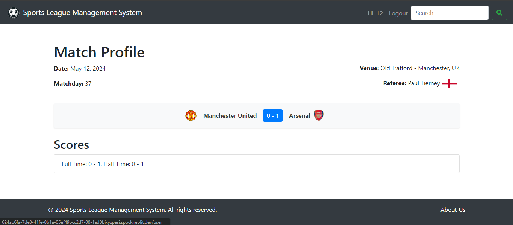

### League Profile Screen
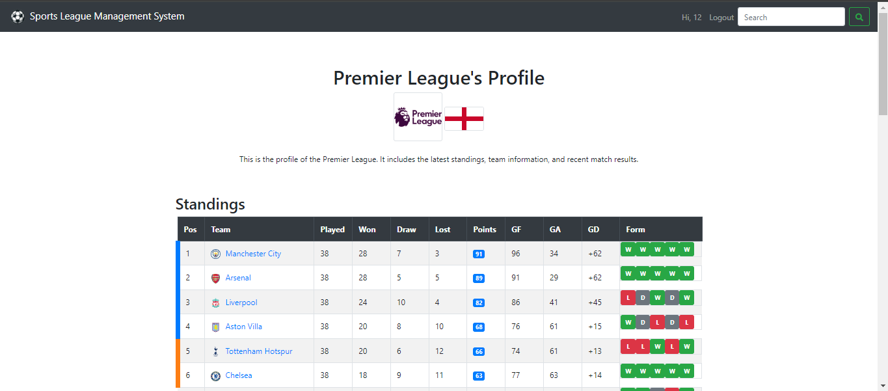

### Standings
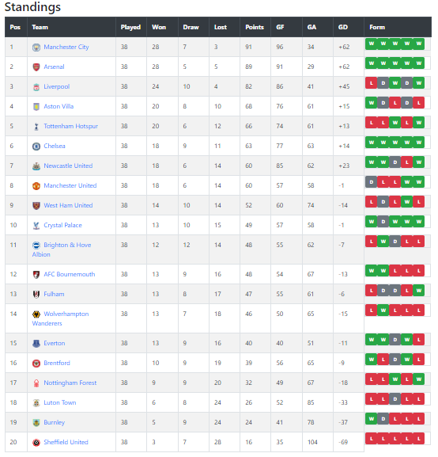

### Team Profile Screen
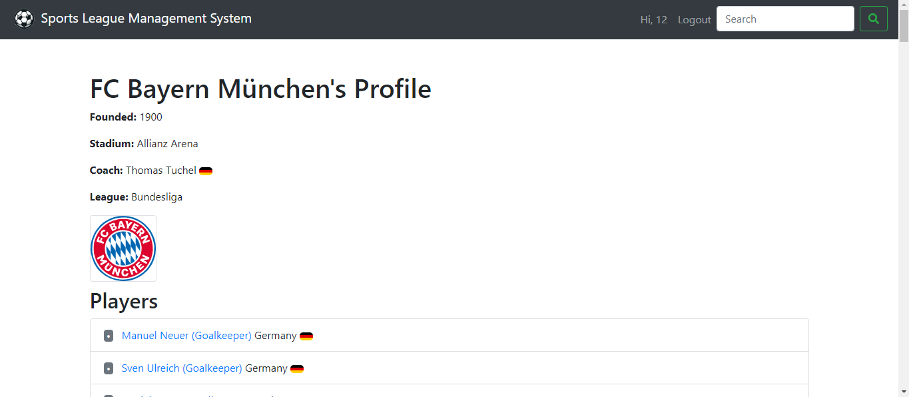

### Player Profile Screen
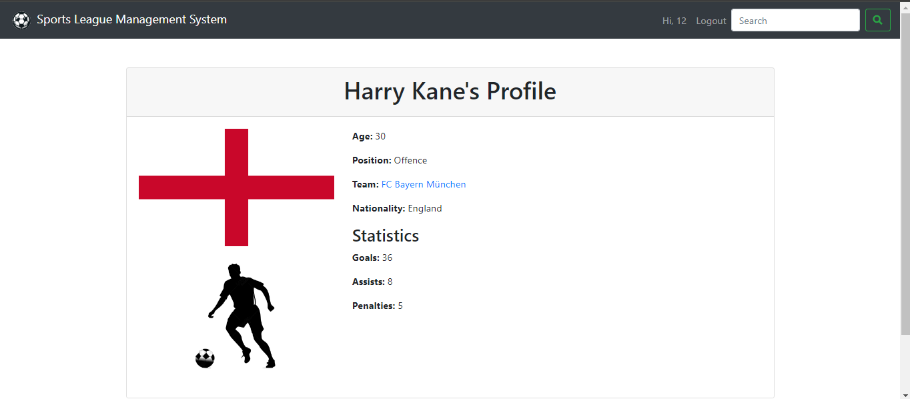

---

## License

This project is licensed under the MIT License - see the [LICENSE](LICENSE) file for details.
